# Fluxo do Sistema — Landscape Metrics Extractor

> Documento descritivo do funcionamento **atual** (real, derivado do código em
> `backend/app/` e `static/`/`frontend-src/` nesta revisão do repositório —
> 2026-07-31). Não é um plano nem um roadmap: para o que ainda falta ou está em
> andamento, ver [ROADMAP.md](ROADMAP.md). Para instruções de instalação/uso,
> ver [README.md](README.md).
>
> ⚠️ A pasta [documentation/](documentation/) ainda descreve a arquitetura
> **anterior** (monólito Streamlit `app.py`/`auth.py`/`db.py`), removida em
> 2026-07-27 (ver ROADMAP, "Remoção completa do Streamlit"). Este documento
> substitui a visão de fluxo daquela pasta pela arquitetura real de hoje:
> **backend FastAPI (Python) + frontend estático TypeScript compilado**.

---

## 1. Visão geral em uma frase

Um usuário autenticado escolhe uma área do território brasileiro (ponto+raio
ou município inteiro) e uma fonte de dados de cobertura do solo (MapBiomas via
Google Earth Engine, ou um GeoTIFF próprio), o backend extrai os pixels reais
dessa área, calcula métricas de paisagem com PyLandStats e devolve o
resultado — que fica salvo no histórico do usuário e pode alimentar análises
agregadas (matriz socioecológica, clustering, predição de anos futuros,
processamento em lote por município).

---

## 2. Arquitetura em alto nível

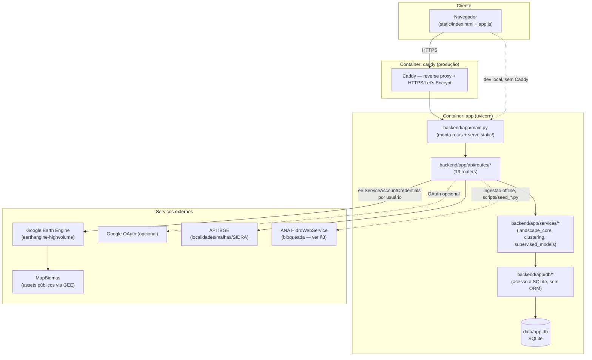

- **Backend**: FastAPI (`backend/app/main.py`), único processo, serve tanto a
  API REST (`/api/...`) quanto os arquivos estáticos do frontend (`static/`).
- **Frontend**: TypeScript compilado sem bundler (`frontend-src/app.ts` →
  `tsc` → `static/app.js`, `.gitignore`, nunca editado à mão). Sem
  framework/SPA-router — página única com abas trocadas via JavaScript
  (`switchTab`), handlers inline (`onclick=`).
- **Persistência**: SQLite em arquivo único (`data/app.db`), sem servidor de
  banco, sem ORM — cada módulo de `backend/app/db/` faz `CREATE TABLE IF NOT
  EXISTS` + `ALTER TABLE` defensivo.
- **Não há mais Streamlit** nem `app.py`/`auth.py`/`db.py` na raiz — removidos
  na migração de 2026-07-27.

---

## 3. O que acontece quando alguém acessa o site

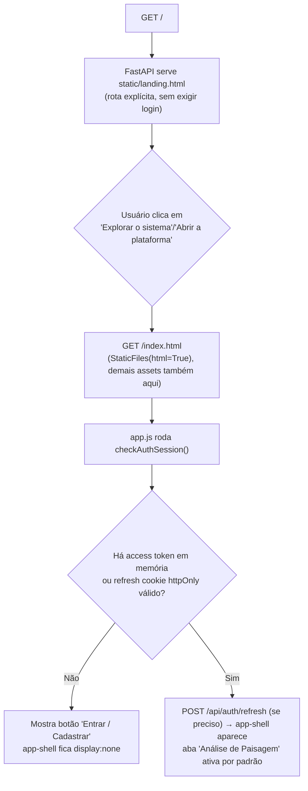

`main.py` registra uma rota explícita para `/` **antes** de montar
`StaticFiles(directory="static", html=True)` — sem isso, o mount serviria
`index.html` (a ferramenta) direto na raiz e a landing page nunca apareceria.

---

## 4. Autenticação e sessão

Dois modos, convivendo pelo mesmo e-mail como chave de identidade (nenhuma
tabela tem FOREIGN KEY para `users` — o e-mail já basta):

- **E-mail/senha** (sempre disponível): cadastro aberto, hash bcrypt em
  `users.password_hash`.
- **Google OAuth** (opcional, só se `google_client_id`/`secret`/`redirect_uri`
  estiverem preenchidos em `backend/.env` — `GET /api/auth/config` informa o
  frontend se deve mostrar o botão).

Sessão = **dois tokens**:

| Token | Formato | Duração | Onde vive |
|---|---|---|---|
| Access token | JWT HS256 (`{email, exp}`) | 15 min (`access_token_expire_minutes`) | Corpo da resposta → memória do JS (nunca `localStorage`) |
| Refresh token | string opaca (`secrets.token_urlsafe`) | 30 dias (`refresh_token_expire_days`) | Cookie `httpOnly`, `path=/api/auth`; só o hash SHA-256 fica em `refresh_tokens` |

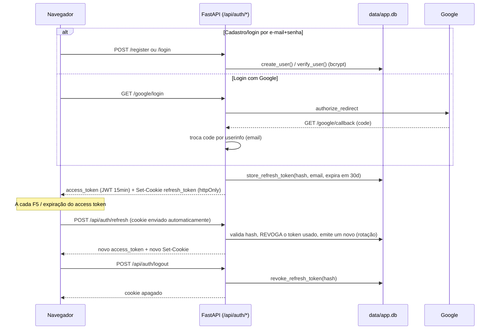

Toda rota protegida usa `Depends(get_current_user)`
(`backend/app/api/deps.py`), que lê `Authorization: Bearer <access_token>` e
decodifica o JWT.

**Bypass de desenvolvimento (temporário, ver `api/deps.py`)**: se
`dev_auth_bypass_email` estiver setado em `backend/.env`, requisições vindas
de **loopback** (`127.0.0.1`/`::1`) autenticam automaticamente como esse
e-mail, sem token. `assert_dev_bypass_is_safe()` recusa subir o processo se
esse bypass estiver ligado junto com `cookie_secure=true` (config de
produção) — existe só para testar localmente sem a fricção do login.

---

## 4.1. Wizard de 5 etapas (pipeline guiado)

A navegação deixou de ser só um menu de abas soltas: existe um wizard global
(`#global-wizard`, barra de "pills" no topo do app) que reflete o progresso do
usuário em 5 etapas, com dependência de dados entre elas — a saída de uma
etapa vira o insumo pré-preenchido da próxima:

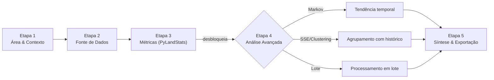

- **Etapas 1-3** vivem na aba "📍 Análise de Paisagem" (mesmo formulário de
  sempre — ver §5). O wizard só espelha, em `wizard-step-1/2/3`, o mesmo
  estado que já acende o stepper local (`updateStepper()` em
  `frontend-src/app.ts`).
- **Etapas 4 e 5** (abas "🧬 Matriz Socioecológica", "🔮 Predição (Markov)",
  "📦 Lote por Município" e a nova "🏁 Síntese & Exportação") ficam com
  cadeado (`.locked`) no menu lateral e no wizard até a Etapa 3 devolver
  pelo menos um resultado real — `pipelineState.hasMetrics`, atualizado por
  `POST /api/metrics/calculate` bem-sucedido **ou** por já existir histórico
  salvo (`GET /api/metrics/history`, checado uma vez após o login via
  `refreshHistoryUnlock()`, para não travar de novo quem já tem análises de
  sessões anteriores). Clicar numa aba travada não navega — mostra um toast
  apontando de volta para a Etapa 3.
- Ao concluir a Etapa 3, um painel "Etapa 4 — escolha uma análise avançada"
  aparece junto do resultado, com botões que já levam o contexto da análise
  (município ou ponto+buffer) pré-preenchido para o formulário de Markov
  (`prefillAdvancedFromLastContext`) — evita redigitar os mesmos parâmetros.
- **Contrato de resposta**: `POST /api/metrics/calculate`, `POST
  /api/markov/predict`, `POST /api/municipio-batch/run` e `POST
  /api/sse/cluster/{kmeans,dbscan}` agora incluem, de forma aditiva (sem
  remover nenhum campo existente), `"step"` (identifica o marco do pipeline
  concluído) e `"next_available_actions"` (quais etapas fazem sentido a
  seguir) — usado hoje só como documentação da API; o frontend decide o
  desbloqueio pelo sucesso HTTP em si, não por esses campos.
- **Etapa 5 — Síntese** (`tab-sintese`, só client-side): agrega, numa única
  tela, os últimos resultados calculados na sessão (`pipelineState` em
  `app.ts` — métricas, predição Markov, clustering, lote por município) e
  oferece "📥 Baixar síntese (JSON)", sem chamar nenhuma rota nova no
  backend.

---

## 5. Fluxo principal — Análise de Paisagem (aba "📍 Análise de Paisagem")

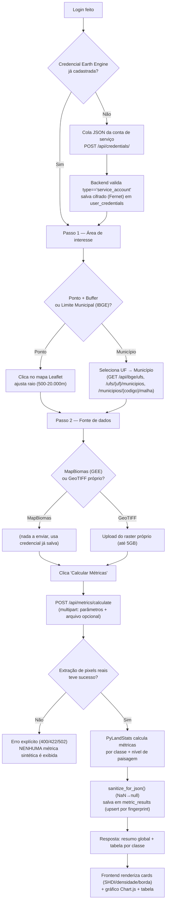

Detalhes de implementação (`backend/app/services/landscape.py`, reaproveita
`services/landscape_core.py`):

- **MapBiomas**: `initialize_earth_engine()` inicializa o SDK com a credencial
  do usuário (`ee.ServiceAccountCredentials`, endpoint
  `earthengine-highvolume`). A ROI vira `ee.Geometry` — buffer circular a
  partir do ponto, ou o polígono do município (resolvido via
  `_get_municipio_geojson_cached`, que checa primeiro o cache nacional
  `municipios_malha` antes de chamar a API do IBGE ao vivo). A extração testa
  4 assets em cascata (Collection 9 → 8 → 7 → 6) até achar um com dado válido
  para a região.
- **GeoTIFF próprio**: recorte local via `rasterio`/`shapely`/`pyproj`, com
  reprojeção automática se o raster estiver em coordenadas geográficas (graus)
  — zona UTM do ponto, ou SIRGAS 2000/Brazil Polyconic no modo raster
  inteiro/município.
- **Regra de negócio constante em todo o pipeline**: falha na extração real
  interrompe o processamento com uma mensagem explicando a causa — o sistema
  nunca substitui dado ausente por um valor fabricado.
- Cada resultado calculado é salvo em `metric_results` (chave
  `(user_email, fingerprint)` — um hash dos parâmetros da análise), o que
  também o torna reaproveitável como cache (mesma área+fonte não recalcula) e
  disponível para as análises agregadas abaixo.

---

## 6. Matriz Socioecológica (SSE) & Clustering (aba "🧬", Etapa 4)

> Aba travada até a Etapa 3 (§5) devolver ao menos um resultado — ver §4.1.

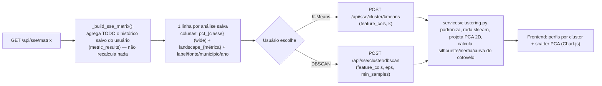

Exige pelo menos 2 análises salvas para rodar qualquer clustering (senão erro
400 explícito).

---

## 7. Predição de anos futuros — Cadeia de Markov (aba "🔮", Etapa 4)

> Aba travada até a Etapa 3 (§5) devolver ao menos um resultado — ver §4.1.
> O botão "🔮 Tendência temporal (Markov)" do painel pós-cálculo já chega
> aqui com município ou ponto+buffer pré-preenchidos a partir da última
> análise.

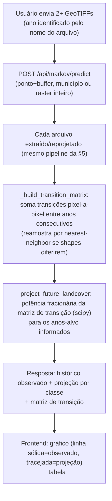

Método explicitamente não-espacial (só projeta proporções agregadas, não um
mapa futuro) e assume estacionariedade das probabilidades de transição — avisado
na própria UI. Escopo atual: apenas via upload de múltiplos GeoTIFFs (não há
extração multi-ano automática via MapBiomas/GEE nesta rota ainda).

---

## 8. Lote por Município via shapefile (aba "📦", Etapa 4)

> Aba travada até a Etapa 3 (§5) devolver ao menos um resultado — ver §4.1.

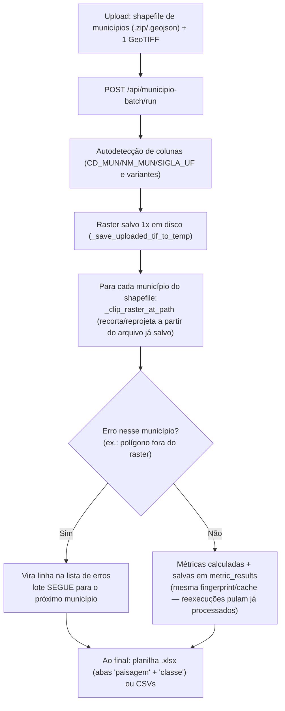

Só GeoTIFF próprio (não MapBiomas/GEE, para não exigir 1 chamada ao Earth
Engine por município do lote). Municípios processados aqui também aparecem
automaticamente na Matriz SSE (§6), por reusarem `municipio_codigo`.

---

## 8.1. Síntese & Exportação (aba "🏁", Etapa 5)

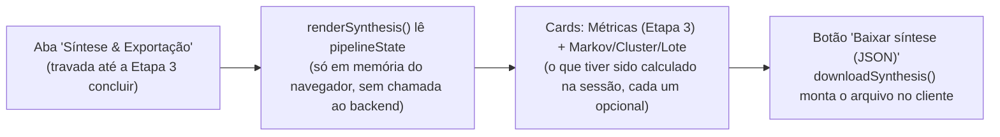

Diferente das demais análises, esta etapa não tem rota própria no backend —
é puramente a agregação, no frontend, do que já foi calculado nas etapas
anteriores desta sessão do navegador (recarregar a página limpa o
`pipelineState`, mas não desfaz nada persistido em `metric_results`).

---

## 9. Dados de referência nacionais (pré-carregados, fora do fluxo interativo)

Quatro tabelas alimentadas por scripts batch (`scripts/seed_*.py`), **não**
pelo usuário em tempo real — servem para acelerar/enriquecer os fluxos acima
sem depender de chamadas de rede a cada requisição:

| Tabela | Script de ingestão | Status | Rota de consulta |
|---|---|---|---|
| `municipios_malha` (~5.570 municípios, malha + população) | `seed_municipios_malha.py` | ✅ Concluído | `GET /api/ibge/ufs`, `/ufs/{uf}/municipios`, `/municipios/{codigo}/malha`, `/municipios/{codigo}/populacao` |
| `prodes_desmatamento` (desmatamento INPE, 6 biomas, ~3,94M registros) | `seed_prodes.py` (+ `reresolve_prodes_municipios.py` para reconserto) | ✅ Concluído | `GET /api/prodes/municipio/{codigo}`, `/resumo` |
| `mapbiomas_municipio_stats` (área por classe/ano/município, 540/540 UF×ano 2004-2023) | `seed_mapbiomas_stats.py` (via Earth Engine ou `--from-excel`) | ✅ Concluído | `GET /api/mapbiomas/serie/{municipio_codigo}` |
| `ana_estacoes`/`ana_serie_historica` (estações fluviométricas/pluviométricas) | `seed_ana_hidroclimatica.py` | 🔧 Script pronto, ingestão real ainda não rodou (credencial obtida, execução pendente) | `GET /api/ana/estacoes`, `/api/ana/serie/{codigo}` — retornam vazio até a carga rodar |

Cada tabela segue o mesmo padrão de resolução de município por junção
espacial (centroide/coordenada dentro do polígono da malha, via
`shapely.strtree.STRtree`) e a mesma regra de "nunca fabricar dado" — um
município não resolvido fica `NULL`, nunca um palpite.

---

## 10. Privacidade / LGPD (aba "📜")

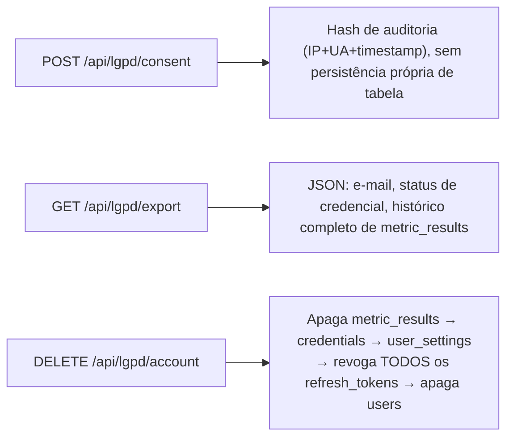

A exclusão revoga explicitamente os refresh tokens ativos — sem isso, uma
sessão já aberta continuaria autenticando via `/api/auth/refresh` mesmo após a
"exclusão" da conta.

---

## 11. Persistência — visão geral das tabelas (`data/app.db`, SQLite)

| Tabela | Papel |
|---|---|
| `users` | conta local (e-mail/senha, hash bcrypt) — usuários só-Google não entram aqui |
| `refresh_tokens` | sessão (hash do refresh token, expiração, revogação) |
| `user_credentials` | credencial Earth Engine por usuário, cifrada (Fernet) |
| `user_settings` | preferências do usuário (JSON livre) |
| `metric_results` | histórico de análises calculadas (chave `user_email+fingerprint`), inclui `municipio_codigo/nome/uf/ano` quando aplicável — base de tudo em §5-§8 |
| `municipios_malha` | cache nacional de malha territorial + população (§9) |
| `prodes_desmatamento` | dados de desmatamento pré-carregados (§9) |
| `mapbiomas_municipio_stats` | série histórica MapBiomas por município (§9) |
| `ana_estacoes` / `ana_serie_historica` | schema pronto, ingestão pendente (§9) |

Sem ORM, sem migração automática — `backend/app/db/schema.py::init_db()` roda
`CREATE TABLE IF NOT EXISTS` + `ALTER TABLE` defensivo a cada boot do
processo.

---

## 12. Endpoints da API (visão consolidada)

| Router | Prefixo | Endpoints |
|---|---|---|
| `auth` | `/api/auth` | `POST /register`, `POST /login`, `POST /refresh`, `POST /logout`, `GET /me`, `GET /config`, `GET /google/login`, `GET /google/callback` |
| `credentials` | `/api/credentials` | `GET /`, `POST /` |
| `metrics` | `/api/metrics` | `GET /history`, `DELETE /history/{fingerprint}`, `POST /calculate` |
| `sse` | `/api/sse` | `GET /matrix`, `POST /cluster/kmeans`, `POST /cluster/dbscan` |
| `supervised` | `/api/supervised` | `POST /train` |
| `markov` | `/api/markov` | `POST /predict` |
| `municipio_batch` | `/api/municipio-batch` | `POST /run` |
| `ibge` | `/api/ibge` | `GET /ufs`, `GET /ufs/{uf}/municipios`, `GET /municipios/{codigo}/malha`, `GET /municipios/{codigo}/populacao` |
| `prodes` | `/api/prodes` | `GET /municipio/{codigo}`, `GET /resumo` |
| `mapbiomas_stats` | `/api/mapbiomas` | `GET /serie/{municipio_codigo}` |
| `ana_hidroclimatica` | `/api/ana` | `GET /estacoes`, `GET /serie/{codigo}` |
| `lgpd` | `/api/lgpd` | `POST /consent`, `GET /export`, `DELETE /account` |
| `user` | `/api/user` | `GET /settings`, `POST /settings` |

Fora de `/api`: `GET /health` (liveness), `GET /` (landing page), demais
caminhos servidos como estáticos (`static/`, incluindo `index.html` da
ferramenta).

> As respostas de `POST /api/metrics/calculate`, `POST /api/markov/predict`,
> `POST /api/municipio-batch/run` e `POST /api/sse/cluster/{kmeans,dbscan}`
> incluem também `"step"` e `"next_available_actions"` — envelope aditivo do
> pipeline em wizard, ver §4.1.

---

## 13. Segurança — pontos que atravessam todo o fluxo

- Senhas: nunca em texto puro — hash bcrypt.
- Credencial do Earth Engine: cifrada em repouso (Fernet, `app_encryption_key`
  — uma chave única para todo o app, não por usuário).
- Sessão: access token de vida curta (15min) em memória do JS + refresh token
  rotacionado a cada uso, em cookie `httpOnly`/`Secure` (produção)/`SameSite=Lax`.
- CORS: `allow_origins=["*"]` no momento (ver `main.py`) — junto com
  `allow_credentials=True`, um ponto a revisar em produção real (o cookie de
  refresh tem `path` restrito e `httpOnly`, mas a política CORS ampla merece
  atenção — não é o foco deste documento descritivo).
- `SessionMiddleware` do Starlette existe **só** para guardar o `state`/nonce
  do handshake OAuth do Google entre `/google/login` e `/google/callback` —
  não é a sessão do usuário (essa é o par JWT+refresh acima).
- Bypass de login (§4) é opt-in, restrito a loopback, e o processo recusa
  subir se ligado junto com config de produção (`assert_dev_bypass_is_safe`).
- Regra transversal a todo o pipeline de métricas: **nunca fabricar dado** —
  qualquer falha de extração/ingestão real interrompe o fluxo com erro
  explícito em vez de gerar um resultado a partir de valores inventados.

---

## 14. Deploy — como o fluxo acima chega ao usuário final

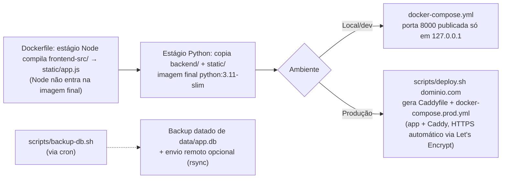

---

## Referências

- [README.md](README.md) — instalação, uso passo a passo, troubleshooting
- [ROADMAP.md](ROADMAP.md) — status fase a fase e histórico detalhado de decisões
- [documentation/](documentation/) — documentação técnica anterior (arquitetura
  Streamlit legada — desatualizada quanto à arquitetura, mas ainda útil para
  contexto histórico de regras de negócio que não mudaram)
