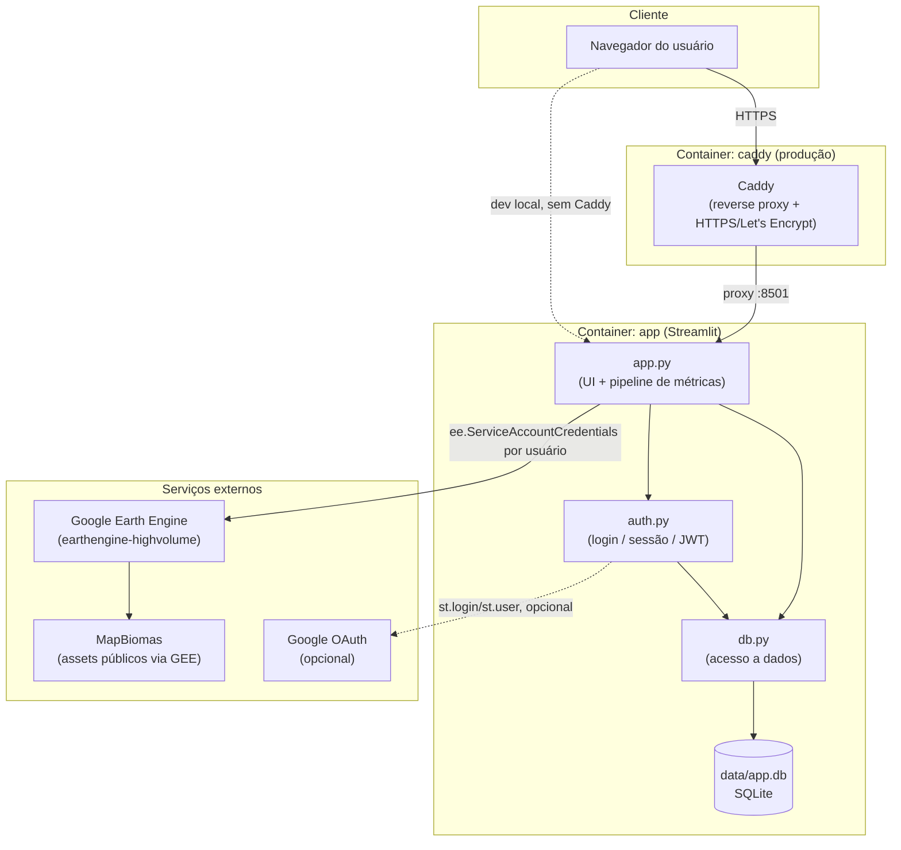

# 02 — Arquitetura

## Visão geral

O sistema é um **monólito Streamlit de página única** (não uma arquitetura de microsserviços nem
uma API REST separada de um frontend). Três módulos Python dividem responsabilidades:

| Módulo | Camada | Responsabilidade |
| --- | --- | --- |
| [app.py](../app.py) | Apresentação + orquestração | UI principal, pipeline de extração/cálculo de métricas |
| [auth.py](../auth.py) | Autenticação/sessão | Landing page, login (e-mail/senha e Google OAuth), sessão |
| [db.py](../db.py) | Acesso a dados | Persistência SQLite (usuários e credenciais criptografadas) |

## Diagrama de componentes

## Camadas

### Frontend / apresentação
Renderizado inteiramente pelo próprio Streamlit (sem framework JS separado). Mapas interativos via
`geemap.foliumap` + `streamlit_folium`; gráficos via `matplotlib`.

### Backend / lógica de negócio
Vive dentro do mesmo processo Streamlit (`app.py`), reexecutado a cada interação do usuário
("rerun" — modelo de execução padrão do Streamlit). O botão "Calcular métricas" controla
explicitamente quando o pipeline pesado (extração + cálculo) roda, guardando o resultado em
`st.session_state` para sobreviver a reruns causados por outros widgets (ex.: o botão de
download).

### Persistência
SQLite local em arquivo único (`data/app.db`, sem servidor de banco separado). Ver
[04_database.md](04_database.md).

### Integrações externas
Google Earth Engine (dados MapBiomas) e, opcionalmente, Google OAuth para login. Ver
[10_integrations.md](10_integrations.md).

## Padrões utilizados

- **Credencial por usuário, não compartilhada**: cada usuário cadastra sua própria conta de
  serviço do Earth Engine (evita esgotar cota de um único projeto GCP compartilhado).
- **Falha explícita, sem fallback sintético**: qualquer falha na extração real de dados interrompe
  o processamento (`st.stop()` / exceção propagada) em vez de substituir por dados fictícios.
- **Criptografia em repouso**: credenciais do Earth Engine cifradas com Fernet antes de persistir.
- **Autenticação dupla**: e-mail/senha (JWT em `session_state`) e Google OAuth (sessão nativa do
  Streamlit) coexistem, usando o e-mail como chave de identidade comum.
- **Deploy conteinerizado**: mesma imagem Docker para desenvolvimento local e produção; produção
  difere apenas por rodar atrás de um proxy reverso Caddy (`docker-compose.prod.yml`).

## Tecnologias

Ver tabela completa em [README.md](../README.md#-tecnologias-utilizadas) e versões exatas em
[requirements.txt](../requirements.txt). Resumo por função:

| Categoria | Tecnologia |
| --- | --- |
| UI / app framework | Streamlit |
| Mapas interativos | geemap, streamlit-folium, folium |
| Geoprocessamento | geopandas, shapely, pyproj, rasterio |
| Dados de satélite | earthengine-api (Google Earth Engine), MapBiomas |
| Métricas de paisagem | PyLandStats |
| Autenticação | PyJWT, bcrypt, Authlib + httpx (Google OAuth) |
| Criptografia | cryptography (Fernet) |
| Persistência | SQLite (biblioteca padrão `sqlite3`) |
| Empacotamento/deploy | Docker, Docker Compose, Caddy |
