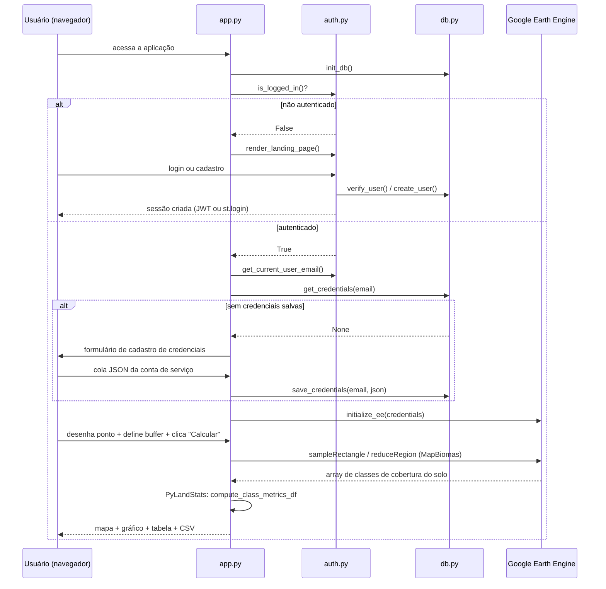

# 03 — Design Detalhado do Sistema

## Componentes principais

### `app.py` — orquestração e pipeline de métricas
Ponto de entrada do Streamlit. Responsável por:
- Gate de login (`db.init_db()` → `auth.is_logged_in()` → `st.stop()` se não autenticado).
- Formulário de cadastro/atualização de credenciais do Earth Engine.
- Inicialização do Earth Engine (`initialize_ee`) com a credencial do usuário logado.
- UI de seleção de ponto (mapa + upload de GeoJSON) e de fonte de dados (MapBiomas ou GeoTIFF
  próprio).
- Pipeline de extração + cálculo de métricas, disparado pelo botão "Calcular métricas".
- Renderização dos resultados (mapa, gráfico, tabela, download CSV).

### `auth.py` — autenticação e sessão
Landing page pública e as duas estratégias de login:
- **E-mail/senha**: `_render_login_form` / `_render_register_form`, com sessão representada por um
  JWT (`_create_token` / `_decode_token`) guardado em `st.session_state["jwt_token"]`.
- **Google OAuth (opcional)**: usa `st.login()` / `st.user` / `st.logout()` nativos do Streamlit,
  ativado apenas se a seção `[auth]` existir em `.streamlit/secrets.toml`
  (`_google_oauth_configured`).

`get_current_user_email()` abstrai qual dos dois modos está ativo — o restante do sistema
(`db.py`, `app.py`) trata apenas "há um e-mail de usuário autenticado", sem saber qual modo foi
usado.

### `db.py` — acesso a dados
Camada fina sobre `sqlite3`, sem ORM. Duas responsabilidades:
- Contas do próprio app (`users`): criação (`create_user`) e verificação (`verify_user`) com hash
  bcrypt.
- Credenciais do Earth Engine por usuário (`user_credentials`): salvar (`save_credentials`) e
  recuperar (`get_credentials`) o JSON da conta de serviço, cifrado com Fernet
  (`app_encryption_key`).

## Comunicação entre módulos

## Decisões arquiteturais

| Decisão | Motivo |
| --- | --- |
| Credencial do Earth Engine por usuário (não compartilhada) | Evitar esgotar cota de um único projeto GCP; isolar falhas de um usuário dos demais. |
| Endpoint `earthengine-highvolume` | O app faz várias chamadas síncronas de leitura de pixels por execução; esse endpoint tem limites de taxa mais adequados a uso interativo. |
| Cálculo disparado por botão explícito (não automático a cada rerun) | Streamlit reexecuta o script inteiro a cada interação; sem esse controle, uploads grandes de GeoTIFF ou chamadas ao GEE seriam refeitos a cada clique em qualquer widget. |
| Resultado do pipeline em `st.session_state` | Sobreviver a reruns causados por outros widgets (ex.: botão de download do CSV) sem repetir chamadas custosas ao GEE ou reprocessar o GeoTIFF. |
| Falha explícita em vez de dados sintéticos de fallback | Uma versão anterior substituía falhas de extração por uma matriz fixa fictícia e seguia exibindo métricas como se fossem reais — risco de integridade de dados removido deliberadamente (ver commit "Adiciona documentação técnica e sinaliza risco de dados sintéticos"). |
| JWT em `session_state` (não em cookie) para login por senha | Simples de implementar; trade-off aceito de não sobreviver a um refresh (F5) da página. |
| SQLite em arquivo único, sem servidor de banco | Simplicidade operacional adequada ao volume esperado (usuários individuais, não multi-tenant em escala). |
| Uma chave de criptografia (`app_encryption_key`) para todo o app, não por usuário | Simplicidade de configuração; implica que qualquer processo com essa chave decifra credenciais de todos os usuários — tratá-la com o mesmo cuidado de uma credencial de produção. |

## Limitações conhecidas de design

- Sem fila de processamento assíncrono: chamadas ao Earth Engine bloqueiam a thread do Streamlit
  durante a execução do pipeline.
- Sem múltiplas páginas/rotas: é um único script; navegação é feita por seções condicionais
  dentro da mesma página.
- Sem camada de API HTTP própria — ver [05_api.md](05_api.md) para o que isso implica em termos de
  integração externa.
