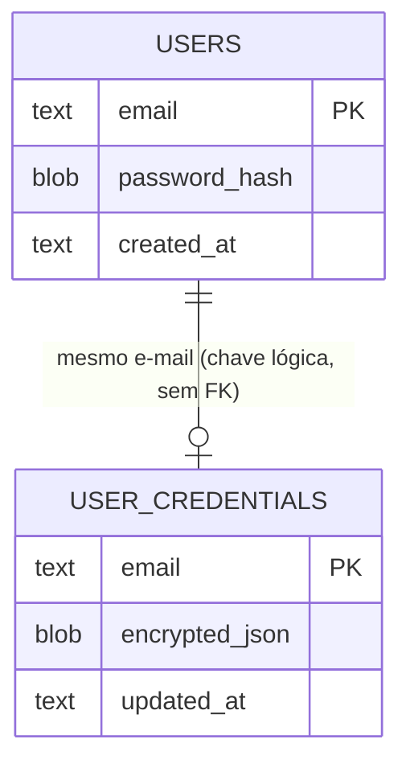

# 04 — Banco de Dados

## Visão geral

Persistência via **SQLite** em arquivo único (`data/app.db`, caminho configurável pela variável de
ambiente `DB_PATH` — ver [db.py](../db.py)). Sem servidor de banco separado, sem ORM, sem sistema
de migrations. Duas tabelas, criadas de forma idempotente em `init_db()`.

## Entidades

### `users`
Contas do próprio app (login por e-mail/senha).

| Coluna | Tipo | Descrição |
| --- | --- | --- |
| `email` | TEXT (PK) | Identidade do usuário — chave usada também em `user_credentials` |
| `password_hash` | BLOB | Hash bcrypt da senha (nunca texto puro) |
| `created_at` | TEXT | Timestamp ISO 8601 (UTC) de criação da conta |

### `user_credentials`
Credencial de conta de serviço do Google Earth Engine, uma por usuário.

| Coluna | Tipo | Descrição |
| --- | --- | --- |
| `email` | TEXT (PK) | Mesma chave de identidade de `users` (também usada por quem loga via Google, mesmo sem linha em `users`) |
| `encrypted_json` | BLOB | JSON da credencial GCP, cifrado com Fernet (`app_encryption_key`) |
| `updated_at` | TEXT | Timestamp ISO 8601 (UTC) da última atualização |

## Relacionamentos

> Não há uma foreign key formal entre as duas tabelas: o vínculo é lógico, pelo valor do e-mail.
> Isso é intencional — um usuário que faz login via Google OAuth nunca tem uma linha em `users`
> (essa tabela só existe para o modo e-mail/senha), mas ainda pode ter uma linha em
> `user_credentials`.

## Regras de negócio no nível de dados

- **Uma credencial ativa por usuário**: `save_credentials` usa
  `INSERT ... ON CONFLICT(email) DO UPDATE`, isto é, salvar uma nova credencial sempre substitui a
  anterior. Não há histórico de credenciais.
- **Senha nunca em texto puro**: `create_user` grava apenas `bcrypt.hashpw(...)`; `verify_user`
  compara com `bcrypt.checkpw(...)`.
- **Credencial nunca em texto puro em disco**: `save_credentials` cifra com Fernet antes de
  persistir; `get_credentials` decifra na leitura.

## Limitações conhecidas

- **Sem migrations**: mudanças de schema em produção exigem lidar manualmente com bancos
  `data/app.db` já existentes.
- **`InvalidToken` mascarado como `None`**: se a chave de criptografia (`app_encryption_key`) for
  perdida/rotacionada ou o dado estiver corrompido, `get_credentials` retorna `None` — o mesmo
  valor retornado para "usuário nunca cadastrou credencial". `app.py` trata os dois casos de forma
  idêntica (mostra o formulário de cadastro), o que pode confundir um usuário que já tinha
  credenciais válidas cadastradas.
- **Sem rotação de chave**: perder `app_encryption_key` torna todas as credenciais salvas
  permanentemente irrecuperáveis; não existe um fluxo de re-criptografia.
- **Backup**: [scripts/backup-db.sh](../scripts/backup-db.sh) copia o arquivo `data/app.db`
  inteiro (dump datado, retendo os 30 mais recentes localmente, com envio opcional via `rsync`
  para `BACKUP_REMOTE`) — não há backup incremental nem point-in-time recovery.
