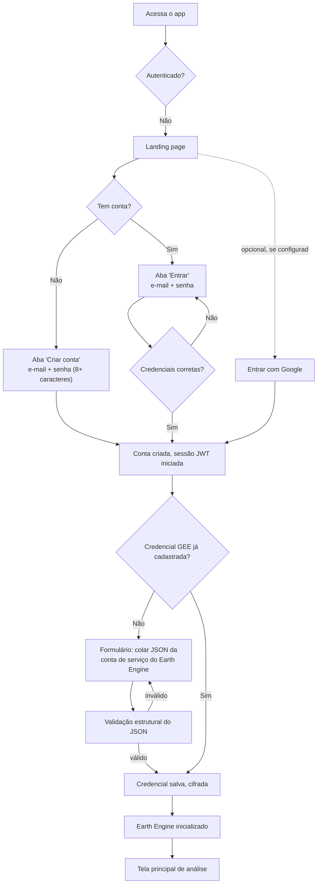
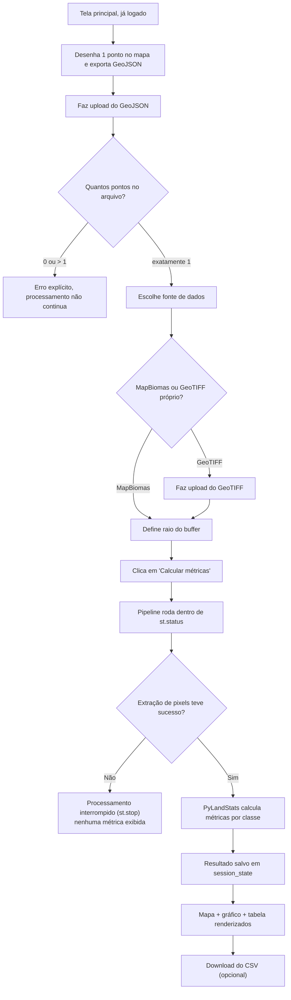
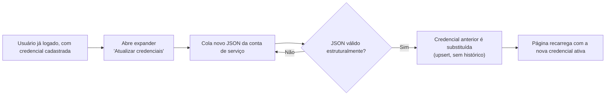
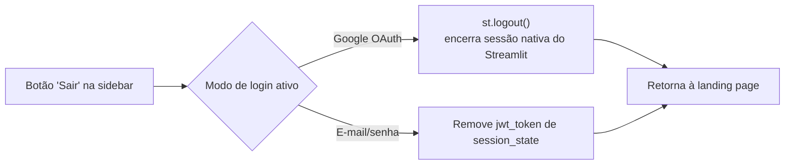

# 07 — Fluxos de Usuário

## Fluxo 1 — Primeiro acesso (cadastro + credenciais)

## Fluxo 2 — Cálculo de métricas de paisagem

## Fluxo 3 — Atualização de credenciais do Earth Engine

## Fluxo 4 — Logout

